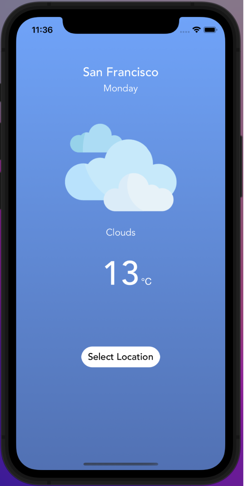
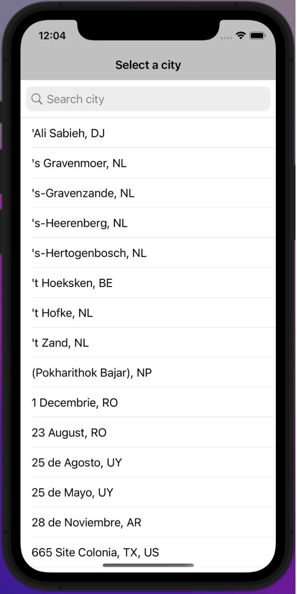
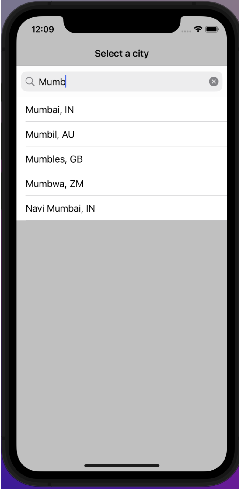
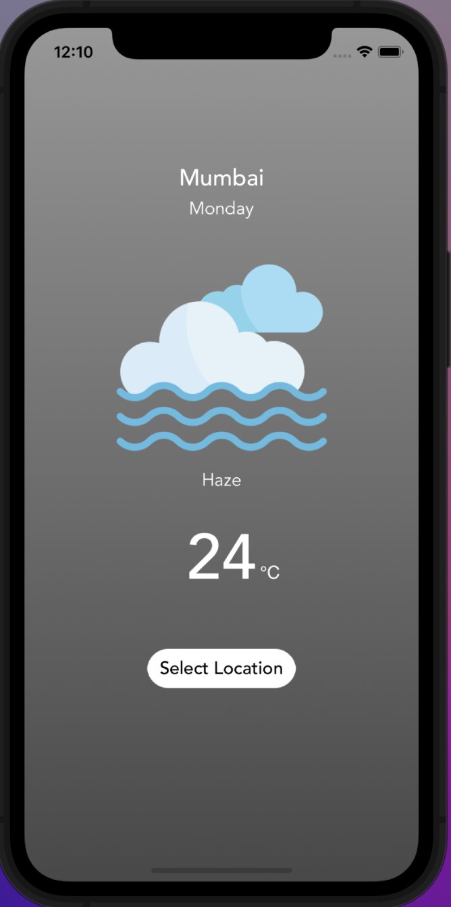

# Swift Weather App

## Overview
The Swift Weather App is a simple yet powerful application built using Swift 5 and Xcode. It provides users with real-time weather updates and forecasts. The interface is designed to be user-friendly, displaying key weather information along with relevant imagery.

## Features
- **Current Location Weather**: Automatically displays weather data for the user's current location.
- **Day and Temperature**: Shows the day of the week and current temperature in degrees Celsius.
- **Weather Conditions**: Describes the current weather conditions along with an icon representation.
- **City Selection**: Users can select different locations to view the weather forecast by clicking on the 'Select Location' button.
- **Search Functionality**: Features a search bar to find cities quickly.
- **Location Permission**: On first launch, the app requests the user's permission to access location data.

## Screens
1. **Home Screen** - Shows the weather data for the user's current location. 
    
    
3. **Select Location** - Allows the user to choose a different city.  
    
4. **Search City** - Users can search for a city using the search bar.  
    
5. **City Weather** - Displays weather data for the selected city.  
    

## Data Sources and Libraries
- **OpenWeather API**: The application fetches weather data using the [OpenWeather API](https://home.openweathermap.org/).
- **City List**: A JSON file containing the list of cities is sourced from the OpenWeather website.

### Libraries Used
- **Alamofire**: For making network requests to the OpenWeather API.
- **SwiftyJSON**: For parsing the JSON responses from the API.
- **NVActivityIndicatorView**: For displaying a loading animation while fetching data.

## Getting Started
To run the Swift Weather App on your local machine, you will need to have Xcode installed. Clone the repository, open the project in Xcode, and run it on your preferred simulator or physical device.

Ensure that you have CocoaPods installed and run `pod install` to get the necessary libraries set up for the project.

## Usage
Upon launching the app, you will be prompted to allow location access. Granting access will automatically display the weather data for your current location. To view the weather in a different city, tap the 'Select Location' button and either select from the list or use the search bar to find your city.

## Acknowledgements
- [OpenWeatherMap](https://openweathermap.org/)
- [Alamofire](https://github.com/Alamofire/Alamofire)
- [SwiftyJSON](https://github.com/SwiftyJSON/SwiftyJSON)
- [NVActivityIndicatorView](https://github.com/ninjaprox/NVActivityIndicatorView)

---

Developed with ❤️ by Roshni Soni
